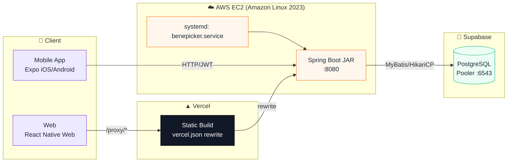
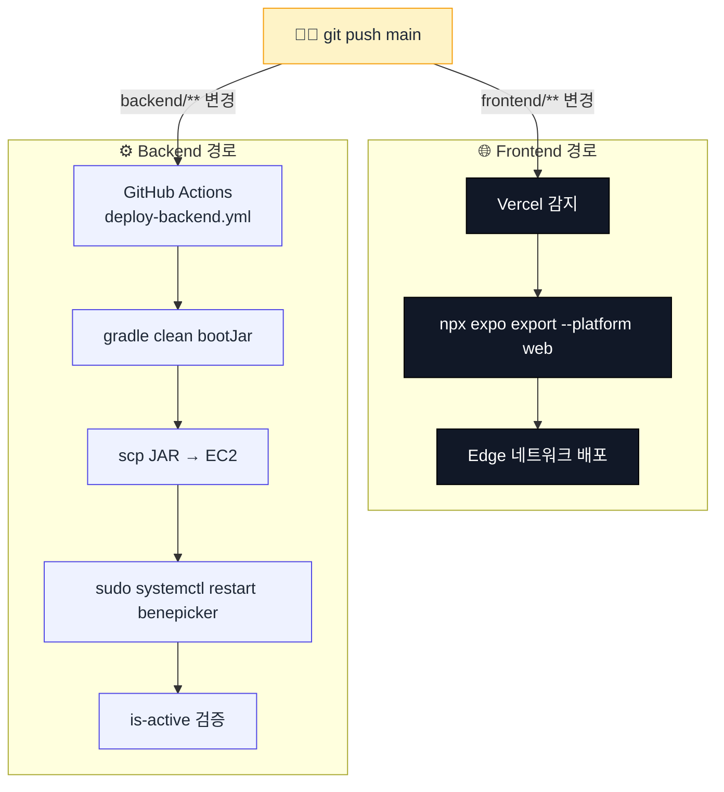
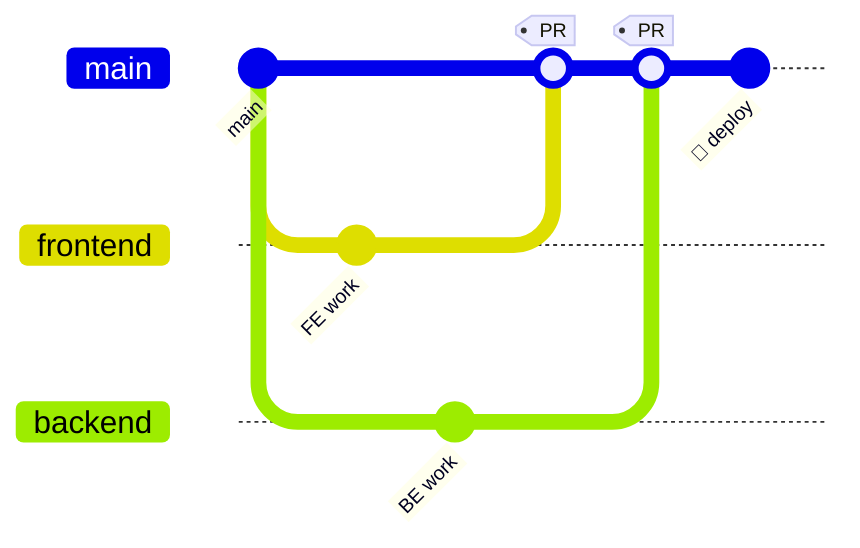

<div align="center">

# 🌿 BenePicker

### _내 주변의 진짜 혜택, 지도 한 번에_

통신사 · 카드 · 멤버십이 뿌려놓은 혜택을 내 위치 기반으로 모아 보여주는 **풀스택 모바일·웹 서비스**

<br/>

[](https://bene-picker.vercel.app)
[](#)
[](#)
[](#)
[](#)

<br/>

[📱 기능](#-주요-기능) ·
[🏗️ 아키텍처](#️-아키텍처) ·
[🛠️ 기술스택](#️-기술-스택) ·
[🚀 배포](#-자동-배포-파이프라인) ·
[🔌 API](#-api-엔드포인트) ·
[⚡ 실행](#-로컬-실행)

</div>

---

## 📱 주요 기능

<table>
<tr>
<td width="50%" valign="top">

### 🏠 홈
내 위치 기준 **인근 혜택** 한눈에.
카드 형태로 카테고리 / 혜택 요약 / 거리 표시.

</td>
<td width="50%" valign="top">

### 🗺️ 지도
카카오맵 위에 매장 **커스텀 핀**.
핀 클릭 → 바텀시트로 매장·혜택·도보 경로.

</td>
</tr>
<tr>
<td valign="top">

### 🔍 검색
매장명·브랜드 자동완성 + **최근 검색어** 관리.
결과 → 바로 지도·혜택 상세로 연결.

</td>
<td valign="top">

### ❤️ 찜
매장·브랜드 단위로 찜. 홈·지도에서 하트 아이콘 토글.

</td>
</tr>
<tr>
<td valign="top">

### 👤 MY
프로필 / 비밀번호 / 개인정보 동의 설정.
프로필 이미지는 **로컬 URI 캐시**로 오프라인에서도 즉시 표시.

</td>
<td valign="top">

### 🔔 실시간
WebSocket 기반 알림 채널 (STOMP/SockJS + 네이티브용 순수 WS).

</td>
</tr>
</table>

---

## 🏗️ 아키텍처



- **네이티브 앱**: EC2 IP에 직접 HTTP 호출 (CORS 제약 없음)
- **웹**: 브라우저 Mixed Content 정책 때문에 `https://` Vercel에서 `http://` EC2로 직접 호출 불가 → `vercel.json` rewrite로 same-origin `/proxy/*` 경로를 EC2로 포워딩
- **상태 관리**: Stateless JWT. `accessToken` / `refreshToken` 모두 AsyncStorage 저장. 401 감지 시 자동 로그아웃 → 로그인 화면 전환

---

## 🛠️ 기술 스택

### ⚙️ Backend `/backend`

<p>


</p>

| 계층 | 라이브러리 / 도구 |
|---|---|
| **Web** | Spring Web + Spring WebSocket (STOMP/SockJS) |
| **Security** | Spring Security (Stateless) + JWT (`jjwt 0.12.3`) + BCrypt |
| **Persistence** | MyBatis 3.0.5 (`mapUnderscoreToCamelCase`) + HikariCP |
| **DB 드라이버** | PostgreSQL 42.7.3 (Supabase Pooler 6543) |
| **Config** | `dotenv-java 3.0.0` → `backend/.env` → `System.setProperty` |
| **Mail** | Spring Boot Starter Mail (이메일 인증용) |
| **문서화** | Springdoc OpenAPI 2.8.5 (`/swagger-ui.html`) |

### 📱 Frontend `/frontend`

<p>


</p>

| 영역 | 내용 |
|---|---|
| **플랫폼** | iOS / Android / Web (단일 코드베이스, React Native Web 0.21) |
| **Navigation** | Bottom Tab (5탭) + Native Stack |
| **State** | Context API (`AuthContext`) |
| **HTTP** | Axios (요청 인터셉터: Bearer 토큰 / 응답 인터셉터: 401 클린업) |
| **저장소** | AsyncStorage — token · 프로필 이미지 로컬 URI |
| **지도** | 네이티브: WebView + Kakao JS SDK HTML 브릿지 / 웹: 직접 SDK 로드 |

---

## 🚀 자동 배포 파이프라인



### 🔐 필요한 GitHub Secrets

| Secret | 내용 |
|---|---|
| `EC2_HOST` | EC2 인스턴스 Public IP |
| `EC2_SSH_KEY` | 키페어 pem 파일 전체 내용 |

### 🎯 EC2 최초 1회 세팅

<details>
<summary><b>펼쳐보기</b></summary>

```bash
# 1) .env 생성 (실제 값으로, mode 600)
cat > ~/BenePicker/backend/.env <<'EOF'
SUPABASE_DB_URL=jdbc:postgresql://...
SUPABASE_DB_USERNAME=postgres.<ref>
SUPABASE_DB_PASSWORD=<secret>
DB_DRIVER=org.postgresql.Driver
JWT_SECRET=<random>
JWT_ACCESS_EXPIRATION=3600000
JWT_REFRESH_EXPIRATION=1209600000
EOF
chmod 600 ~/BenePicker/backend/.env

# 2) CI가 SSH로 들어올 수 있게 공개키 등록
mkdir -p ~/.ssh && chmod 700 ~/.ssh
# <pem 공개키 한 줄 >> ~/.ssh/authorized_keys
chmod 600 ~/.ssh/authorized_keys

# 3) systemd 유닛 설치
sudo cp ~/BenePicker/deploy/benepicker.service /etc/systemd/system/
sudo systemctl daemon-reload
sudo systemctl enable --now benepicker
```

</details>

---

## 🔌 API 엔드포인트

> 🔓 = 인증 불필요, 🔒 = `Authorization: Bearer <accessToken>` 필수

### 👤 회원 · 인증

| | Method | Path | 설명 |
|---|---|---|---|
| 🔓 | `POST` | `/api/member/login` | 로그인 (`memberEmail`, `memberPw` → access/refresh) |
| 🔓 | `POST` | `/api/member/signup` | 회원가입 |
| 🔓 | `GET` | `/api/member/check-email` | 이메일 중복 확인 |
| 🔓 | `GET` | `/api/member/check-nickname` | 닉네임 중복 확인 |
| 🔓 | `GET` | `/api/member/email/**` | 이메일 인증 메일 송수신 |
| 🔒 | `GET` | `/api/member/me` | 내 정보 |
| 🔒 | `PATCH` | `/api/member/me/profile` | 프로필 수정 |
| 🔒 | `PATCH` | `/api/member/me/password` | 비밀번호 변경 |
| 🔒 | `PATCH` | `/api/member/me/privacy` | 개인정보 동의 변경 |
| 🔒 | `POST` | `/api/auth/logout` | 로그아웃 |

### 🗺️ 홈 · 지도 · 혜택

| | Method | Path | 설명 |
|---|---|---|---|
| 🔒 | `GET` | `/api/home/benefits/nearby` | 홈: 내 주변 혜택 |
| 🔒 | `GET` | `/api/map` | 지도: 마커 + 매장 + 혜택 통합 |
| 🔒 | `GET` | `/benefits/{benefitId}` | 혜택 상세 |

### 🔍 검색 · 찜

| | Method | Path | 설명 |
|---|---|---|---|
| 🔒 | `GET` | `/search` | 매장 · 브랜드 검색 |
| 🔒 | `GET` | `/search/history` | 최근 검색어 |
| 🔒 | `DELETE` | `/search/history/{searchId}` | 검색어 개별 삭제 |
| 🔒 | `DELETE` | `/search/history` | 검색어 전체 삭제 |
| 🔒 | `POST`/`DELETE` | `/wishes/stores/{storeId}` | 매장 찜 토글 |
| 🔒 | `POST`/`DELETE` | `/wishes/brands/{brandId}` | 브랜드 찜 토글 |

### 🔔 실시간

| | Path | Protocol |
|---|---|---|
| 🔓 | `/ws` | SockJS + STOMP (웹) |
| 🔓 | `/ws-native` | 순수 WebSocket (모바일) |

> 응답은 모두 `ApiResponse<T>` 래퍼: `{ code, message, data }`

---

## 📁 프로젝트 구조

<details open>
<summary><b>🌳 전체 트리</b></summary>

```
BenePicker/
│
├── 📦 backend/                             Spring Boot REST API + WebSocket
│   ├── build.gradle
│   ├── settings.gradle                     rootProject.name = 'backend'
│   ├── gradlew                             Gradle wrapper
│   └── src/main/
│       ├── java/com/benepicker/
│       │   ├── BenePickerApplication.java
│       │   ├── common/
│       │   │   ├── auth/                   JWT Principal / UserDetails
│       │   │   ├── config/                 Security · DB · WebSocket · Swagger · Env
│       │   │   ├── exception/              전역 예외 핸들러
│       │   │   └── util/                   JwtUtil · JwtFilter · Utility
│       │   ├── auth/                       로그아웃
│       │   ├── member/                     회원 · 로그인 · 프로필
│       │   ├── home/                       홈 데이터
│       │   ├── map/                        지도 마커 · 매장 상세
│       │   ├── benefit/                    혜택 상세
│       │   ├── search/                     검색 + 최근 검색어
│       │   └── wish/                       매장 · 브랜드 찜
│       └── resources/
│           ├── application.properties      ${...} 플레이스홀더 → .env 에서 주입
│           ├── config.properties.example
│           ├── mybatis-config.xml
│           ├── mappers/*-mapper.xml        MyBatis SQL 정의
│           └── sql/V1__add_member_carrier.sql   마이그레이션
│
├── 📱 frontend/                            Expo 앱 (iOS/Android/Web)
│   ├── App.jsx                             AuthProvider + Navigation
│   ├── app.json                            Expo 설정
│   ├── vercel.json                         웹 빌드 + /proxy rewrite
│   ├── package.json
│   └── src/
│       ├── api/                            Axios + 도메인별 API
│       ├── constants/                      API base URL · Kakao 키
│       ├── context/                        AuthContext
│       ├── navigation/                     Auth / App Navigator
│       └── screens/
│           ├── auth/        (Login, Signup)
│           ├── home/        (HomeScreen)
│           ├── map/         (Native + Web 분기)
│           ├── search/      (SearchScreen)
│           ├── history/     (HistoryScreen)
│           ├── bookmark/    (BookmarkScreen)
│           └── mypage/      (MyPageScreen)
│
├── 🚢 deploy/
│   └── benepicker.service                  systemd unit (EC2 배포용)
│
├── ⚙️ .github/workflows/
│   └── deploy-backend.yml                  GitHub Actions — 백엔드 자동 배포
│
└── 📖 README.md
```

</details>

---

## ⚡ 로컬 실행

### 1️⃣ 백엔드

```bash
cd backend

# backend/.env 먼저 작성 (환경변수 섹션 참고)

./gradlew bootRun
```

| | URL |
|---|---|
| API | `http://localhost:8080` |
| Swagger | `http://localhost:8080/swagger-ui.html` |

### 2️⃣ 프론트 (모바일)

```bash
cd frontend
npm install

npm run android   # Android 에뮬레이터
npm run ios       # iOS (macOS)
npm start         # Metro (Expo Go)
```

> Android 에뮬레이터 → 백엔드 호출은 `10.0.2.2:8080` 자동 매핑
> 실기기 테스트 시 `src/constants/config.js` 의 네이티브 URL을 PC 로컬 IP로 교체

### 3️⃣ 프론트 (웹)

```bash
cd frontend
npm run web          # 브라우저 프리뷰
npm run build:web    # dist/ 정적 빌드
```

---

## 🌱 환경변수

<details>
<summary><b>📄 backend/.env (mode 600, gitignored)</b></summary>

```env
# ───── Supabase PostgreSQL ─────
SUPABASE_DB_URL=jdbc:postgresql://<pooler-host>:6543/postgres?prepareThreshold=0
SUPABASE_DB_USERNAME=postgres.<project-ref>
SUPABASE_DB_PASSWORD=<rotated-password>
DB_DRIVER=org.postgresql.Driver

# ───── JWT ─────
JWT_SECRET=<random-256-bits-or-more>
JWT_ACCESS_EXPIRATION=3600000       # 1h
JWT_REFRESH_EXPIRATION=1209600000   # 14d
```

`common/config/EnvConfig.java` 의 static 블록이 앱 기동 시
Dotenv 로 읽어 `System.setProperty()` 로 주입합니다 → `application.properties` 의 `${SUPABASE_DB_URL}` 등 플레이스홀더가 해석됨.

</details>

<details>
<summary><b>🗺️ frontend 설정 파일</b></summary>

| 파일 | 용도 |
|---|---|
| `src/constants/kakao.js` | Kakao JavaScript 앱 키 |
| `src/constants/config.js` | API Base URL (웹: `/proxy` / 네이티브: EC2 IP) |

</details>

---

## 🔒 CORS · 공개 경로

### 🌍 허용 Origin

```
http://localhost:5173
https://bene-picker.vercel.app
https://*.vercel.app        (프리뷰 포함)
```

### 🔓 인증 없이 접근 가능

<table>
<tr><td>

**회원**
- `/api/member/login`
- `/api/member/signup`
- `/api/member/check-email`
- `/api/member/check-nickname`
- `/api/member/email/**`

</td><td>

**기타**
- `/ws/**`, `/ws-native/**`
- `/swagger-ui/**`
- `/swagger-ui.html`
- `/v3/api-docs/**`

</td></tr>
</table>

---

## 🌿 브랜치 전략



| 브랜치 | 역할 |
|---|---|
| `main` | 🚀 **배포 기준** (Vercel + EC2 자동) — 직접 푸시 지양 |
| `frontend` | 📱 모바일·웹 프론트 작업 |
| `backend` | ⚙️ 백엔드 작업 |
| `feat/*` · `fix/*` · `chore/*` · `docs/*` | 단위 작업 브랜치 |

### 📝 커밋 태그

| Tag | 용도 | 예시 |
|---|---|---|
| `[Add]` | 기능·파일 추가 | `[Add] 회원가입 API` |
| `[Fix]` | 버그 수정 | `[Fix] 토큰 만료 401 처리` |
| `[Update]` | 기능 수정 | `[Update] 로그인 유효성` |
| `[Delete]` | 제거 | `[Delete] 미사용 util` |
| `[Chore]` | 설정·주석 | `[Chore] gitignore 조정` |

> 기존 히스토리엔 도메인 prefix(`웹 지도:` 등) 스타일도 혼재 — 둘 다 OK.

---

## ✍️ 코딩 컨벤션

### 🔤 네이밍

| 케이스 | 용도 | 예 |
|---|---|---|
| `camelCase` | 변수 · 함수 | `memberEmail` · `handleLogin()` |
| `PascalCase` | 클래스 · DTO · 컴포넌트 | `MemberController` · `LoginScreen` |
| `UPPER_SNAKE_CASE` | 상수 | `API_BASE_URL` |

### 🔑 API 필드 규약 (DTO 기준, **snake_case 금지**)

```ts
// 로그인 요청
{ memberEmail, memberPw }

// 회원가입 요청
{ memberEmail, memberPw, memberNickname, memberTel? }

// 로그인 응답
{ accessToken, refreshToken }
```

### 💬 주석 (필요 시)

<table>
<tr>
<td width="50%">

**Backend (JavaDoc)**
```java
/**
 * dev. 이름
 * 기능 : 회원 정보 조회
 * @param memberNo 회원 번호
 * @return Member
 */
```

</td>
<td width="50%">

**Frontend (JSDoc)**
```javascript
/**
 * dev. 이름
 * 기능 : 로그인 API 호출
 */
```

</td>
</tr>
</table>

---

## ⚠️ 주의사항

> 이 프로젝트는 `main` 푸시가 즉시 프로덕션 배포를 트리거합니다. 아래 규칙을 반드시 지켜주세요.

| 🚨 | 내용 |
|---|---|
| 🔐 | `backend/.env`, `backend/src/main/resources/config.properties` **절대 커밋 금지** (gitignore 처리됨) |
| 🔑 | 민감 값은 채팅·이슈·PR 본문에 평문 노출 금지 — **노출 즉시 Supabase 콘솔에서 로테이트** |
| 🚀 | `main` 직접 푸시 → 즉시 배포 트리거. **반드시 PR 경유** |
| 🔁 | EC2 SSH 키 교체 시 `~/.ssh/authorized_keys` **와** GitHub Secret `EC2_SSH_KEY` **양쪽** 동시 갱신 |
| 📝 | 본인이 올린 PR 본인이 머지 지양 |

---

<div align="center">

### 🌿 BenePicker Team

_Made with Spring Boot 🍃 + Expo 📱_

<sub>© 2026 BenePicker</sub>

</div>
